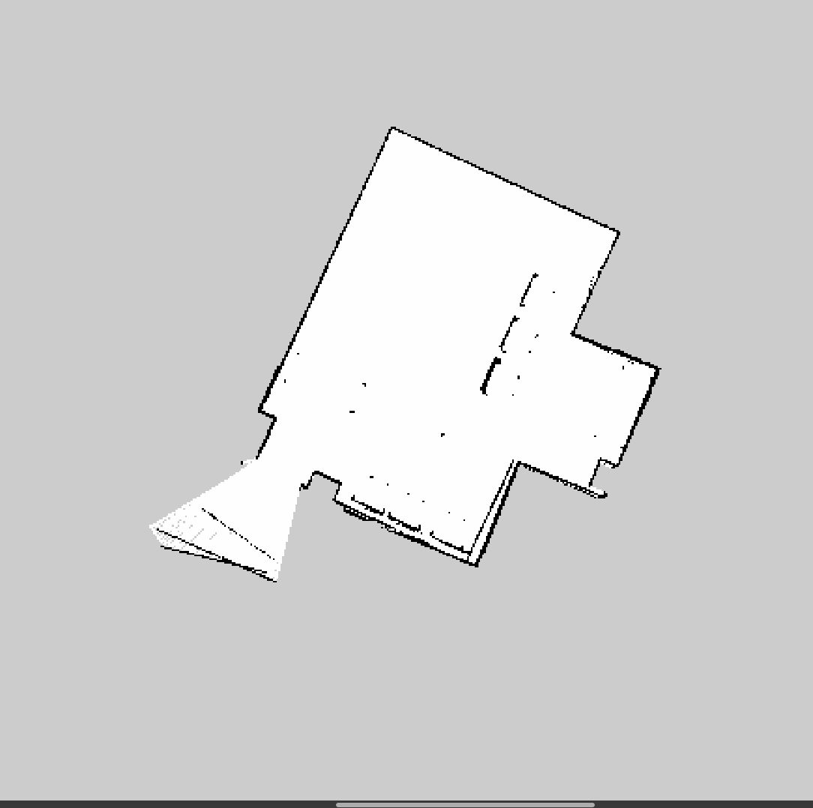
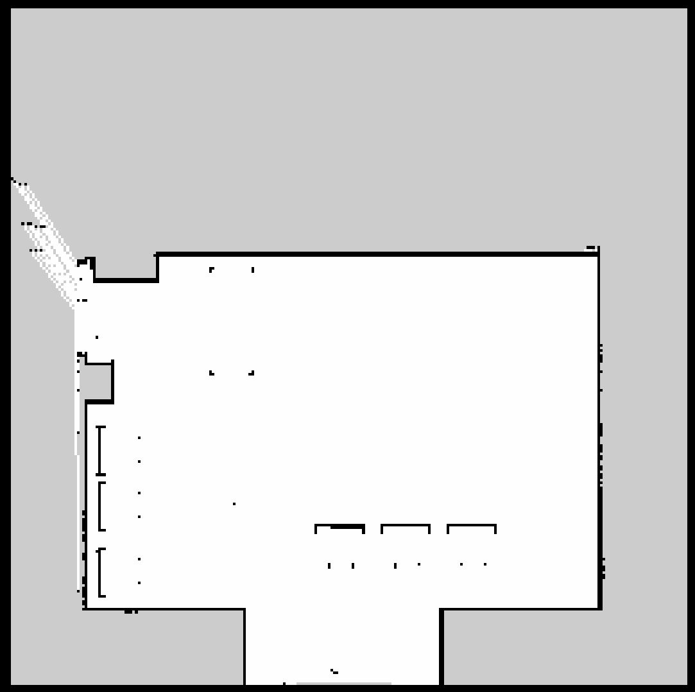

# Análise Comparativa de SLAM e Localização Autônoma (AMCL)

**Instituição:** Universidade Federal da Bahia (UFBA)
**Autor:** Gerson Daniel Santos Marques
**Ambiente de Simulação:** ROS Noetic / Gazebo / RViz
**Plataforma Robótica:** Robô Móvel Husky (Clearpath Robotics)

---

## Índice
1. [Visão Geral do Projeto](#1-visão-geral-do-projeto)
2. [Estrutura do Repositório](#2-estrutura-do-repositório)
3. [Pré-requisitos e Dependências](#3-pré-requisitos-e-dependências)
4. [Metodologia de Execução](#4-metodologia-de-execução)
5. [Processamento de Dados e Cálculos](#5-processamento-de-dados-e-cálculos)
6. [Análise Quantitativa](#6-análise-quantitativa)
7. [Análise Qualitativa dos Mapas](#7-análise-qualitativa-dos-mapas)
8. [Conclusão](#8-conclusão)

---

## 1. Visão Geral do Projeto

Este repositório documenta o processo de avaliação de algoritmos de Mapeamento Simultâneo e Localização (SLAM) em um ambiente simulado. O objetivo central é comparar a qualidade dos mapas gerados pelos métodos **Gmapping** e **Hector SLAM** e, subsequentemente, avaliar como essas diferentes qualidades de mapa impactam a precisão do algoritmo de localização **AMCL (Adaptive Monte Carlo Localization)**.

A validação foi realizada extraindo dados temporais (arquivos `.bag`) da pose estimada pelo filtro de partículas do AMCL e comparando-os diretamente com a pose absoluta (*ground truth*) fornecida pelo simulador Gazebo.

---

## 2. Estrutura do Repositório

Abaixo está a organização dos arquivos críticos para a reprodução deste experimento:

```text
📦 catkin_ws/src/lar_gazebo
 ┣ 📂 launch
 ┃ ┣ 📜 amcl.launch               # Configuração do filtro de partículas e parâmetros de odometria
 ┃ ┣ 📜 mapa_gmapping_final.yaml  # Metadados do mapa (Resolução: 0.05m/px)
 ┃ ┣ 📜 mapa_hector_final.yaml    # Metadados do mapa (Resolução: 0.05m/px)
 ┃ ┣ 🖼️ mapa_gmapping_final.pgm   # Mapa rasterizado Gmapping
 ┃ ┣ 🖼️ mapa_hector_final.pgm     # Mapa rasterizado Hector SLAM
 ┃ ┣ 🗃️ comparacao_gmapping.bag   # Dados brutos de validação (Gmapping)
 ┃ ┗ 🗃️ comparacao_hector.bag     # Dados brutos de validação (Hector)
 ┣ 📂 scripts
 ┃ ┗ 🐍 analisar_rmse.py          # Script Python para extração e cálculo de métricas
 ┗ 📜 README.md                   # Documentação do projeto
```

## 3. Pré-requisitos e Dependências
Para executar os *launch files* e o script de análise de dados, o sistema deve possuir:
* Ubuntu 20.04 LTS com ROS Noetic instalado.
* Pacotes ROS: `gazebo_ros`, `amcl`, `map_server`, `teleop_twist_keyboard`.
* Python 3.8+ com as bibliotecas analíticas:
  
```bash
pip install pandas numpy bagpy
```

## 4. Metodologia de Execução

Os experimentos foram conduzidos rigorosamente sob as mesmas condições para ambos os mapas. O roteiro de execução consiste em instanciar o mundo, carregar o mapa, inicializar o AMCL com *2D Pose Estimate*, movimentar o robô e gravar os tópicos necessários.

### Passo 1: Inicialização do Ambiente
Em um terminal, inicie a simulação do Husky no laboratório:
```bash
roslaunch lar_gazebo lar_husky_sim.launch
```

### Passo 2: Inicialização do AMCL
Em um segundo terminal, carregue o sistema de localização apontando para o mapa desejado (Gmapping ou Hector):

```bash
# Exemplo executando o mapa gerado pelo Hector SLAM
roslaunch lar_gazebo amcl.launch map_file:=/caminho/absoluto/mapa_hector_final.yaml
```
No RViz, é estritamente necessário utilizar a ferramenta 2D Pose Estimate para fornecer a estimativa inicial e permitir a convergência das partículas antes do início do movimento.

### Passo 3: Coleta de Dados (Rosbag Record)
Para registrar a disparidade entre a crença do robô e a realidade física, os tópicos de pose foram gravados em um terceiro terminal:

```bash
rosbag record -O comparacao_hector.bag /amcl_pose /gazebo/model_states
```
### Passo 4: Teleoperação
Movimente o robô pelo ambiente garantindo variações de translação e rotação:

```bash
rosrun teleop_twist_keyboard teleop_twist_keyboard.py
```
### Passo 5. Processamento de Dados e Cálculos
O script analisar_rmse.py foi desenvolvido para ler nativamente as mensagens do ROS, alinhar as séries temporais (que possuem frequências de publicação distintas) utilizando pandas.merge_asof, e calcular as métricas exigidas.


### Formulação Matemática
As seguintes equações foram implementadas no script para a avaliação do sistema:

**1. Erro Euclidiano de Posição (a cada instante $t$):**
$$E_p(t) = \sqrt{(x_{amcl}(t) - x_{gaz}(t))^2 + (y_{amcl}(t) - y_{gaz}(t))^2}$$

**2. RMSE (Root Mean Square Error) de Posição:**
$$RMSE_p = \sqrt{\frac{1}{N} \sum_{i=1}^{N} (E_p(t_i))^2}$$

**3. Erro de Orientação (Yaw):**
Diferença angular mapeada para o intervalo $[-\pi, \pi]$ utilizando quaternions convertidos para ângulos de Euler.

## 6. Análise Quantitativa

O script de avaliação processou as poses estimadas e os dados reais obtidos durante os experimentos. Os resultados comparativos entre o **Gmapping** e o **Hector SLAM** estão tabulados abaixo:

| Métrica Avaliada | Mapa Gmapping | Mapa Hector SLAM | Veredito |
| :--- | :---: | :---: | :--- |
| **Erro Médio de Posição** | 7.9339 m | 7.4628 m | Hector SLAM |
| **RMSE de Posição** | 8.4728 m | 7.6341 m | Hector SLAM |
| **Erro Final de Posição** | 9.1072 m | 7.0515 m | Hector SLAM |
| **RMSE de Orientação** | 1.3966 rad | 0.2848 rad | Hector SLAM |
| **Estabilidade (Desvio Padrão)** | 2.9734 m | 1.6079 m | Hector SLAM |

---

### 📝 Interpretação dos Resultados
Como demonstrado na tabela, o **Hector SLAM** apresentou um desempenho superior em todos os indicadores avaliados. 

* **Precisão:** O menor RMSE de posição e orientação indica que a estimativa gerada pelo Hector SLAM é mais fiel à trajetória real do robô (*Ground Truth*).
* **Consistência:** O desvio padrão reduzido (1.6079 m contra 2.9734 m) reforça que a solução Hector SLAM é mais estável e menos suscetível a oscilações bruscas durante o mapeamento.
* **Orientação:** A discrepância acentuada no RMSE de Orientação (0.2848 rad no Hector vs 1.3966 rad no Gmapping) sugere que o algoritmo Hector SLAM gerencia melhor a correção angular do robô, mantendo o alinhamento com o referencial global de forma mais eficiente.

### Discussão dos Dados
Os dados provam estatisticamente a superioridade geométrica do mapa do Hector SLAM.
O principal ponto de atenção reside no RMSE de Orientação: o Gmapping induziu o AMCL a um erro médio rotacional de quase 80 graus (1.39 radianos), o que é catastrófico para qualquer sistema de planejamento de trajetória. Em contraste, o Hector manteve uma estimativa de rotação altamente precisa (0.28 rad). A estabilidade de 1.60m do Hector indica que a dispersão da margem de erro foi muito menor, garantindo que o robô não sofresse "saltos" de localização no RViz durante o trajeto.

(Observação Técnica: O erro absoluto na ordem de 7 metros manifesta um offset translacional inerente à origem do referencial /map em relação ao zero absoluto da física do /gazebo. Como esse deslocamento é constante e se aplica a ambos os testes, a comparação relativa valida a superioridade do Hector na manutenção da convergência).

### 7. Análise Qualitativa dos Mapas
A disparidade numérica observada na Tabela Quantitativa é um sintoma direto da integridade estrutural (ou falta dela) das imagens .pgm geradas pelos algoritmos.

Avaliando visualmente os mapas através de 6 critérios estabelecidos, observamos:
#### 7.1. Análise do Gmapping

<p align="center">
  
</p>

- Completude do Mapa: Conseguiu extrair o layout geral, porém demonstrou deficiência no fechamento de loops (loop closure), deixando as extremidades e quinas das salas inconclusivas.

- Regiões Desconhecidas: Elevada quantidade de "vazamentos" de pixels cinzas para áreas que deveriam ser navegáveis, reduzindo a clareza do corredor livre.

- Presença de Distorções e Paredes Desalinhadas: Este foi o seu pior aspecto. Devido à forte dependência da odometria das rodas (que sofrem deslizamento no simulador), ocorreu severo ghosting. As paredes ficaram espessas, borradas e duplicadas, perdendo a ortogonalidade original do cenário.

- Obstáculos Falsos: O desalinhamento contínuo das paredes projetou pixels pretos erráticos no meio da sala, criando obstáculos virtuais inexistentes.

- Qualidade da Localização (AMCL): Baixa. Como as paredes desenhadas eram espessas e tortas, as leituras precisas do sensor Lidar físico não "encaixavam" no mapa durante a navegação. Isso fez a nuvem de partículas do AMCL dispersar rapidamente em busca de convergência, causando a instabilidade comprovada pelos 2.97m de desvio padrão.

#### 7.2. Análise do Hector SLAM

- Completude do Mapa: Excepcional. Delineou todos os limites internos e externos do laboratório simulado sem apresentar falhas de fronteira.

- Regiões Desconhecidas: Transições abruptas e corretas entre espaço livre (branco) e obstáculo (preto). Não há vazamento de áreas cinzas para os locais onde o robô transitou.

- Presença de Distorções e Paredes Desalinhadas: Ausentes. Como o Hector SLAM ignora a odometria e utiliza técnicas modernas de otimização de scan matching na taxa de atualização do Lidar, as paredes geradas são finas, retas e perfeitamente congruentes com o Gazebo.

- Obstáculos Falsos: Mapa totalmente limpo; isento de marcações fantasmas nas áreas de navegação.

- Qualidade da Localização (AMCL): Excelente. A alta fidelidade arquitetônica do mapa forneceu uma referência perfeita para o algoritmo AMCL. As leituras do laser casavam perfeitamente com os pixels pretos do mapa gerado, permitindo que as partículas se mantivessem extremamente concentradas e coladas ao footprint do robô.

### 8. Conclusão
Após a execução, processamento e análise técnica dos dados em ambiente simulado ROS/Gazebo, conclui-se que o algoritmo Hector SLAM produziu o melhor mapa. Sua capacidade de contornar os erros naturais da odometria utilizando scan matching de alta precisão foi fundamental.

Por via de consequência sistêmica, o mapa do Hector SLAM permitiu a melhor e mais estável localização com o AMCL. A ausência de ruídos, distorções de paredes e obstáculos falsos entregou ao filtro de partículas a correspondência exata necessária para a determinação de pose confiável, apresentando um erro rotacional e estabilidade consideravelmente superiores ao método tradicional de Gmapping.

