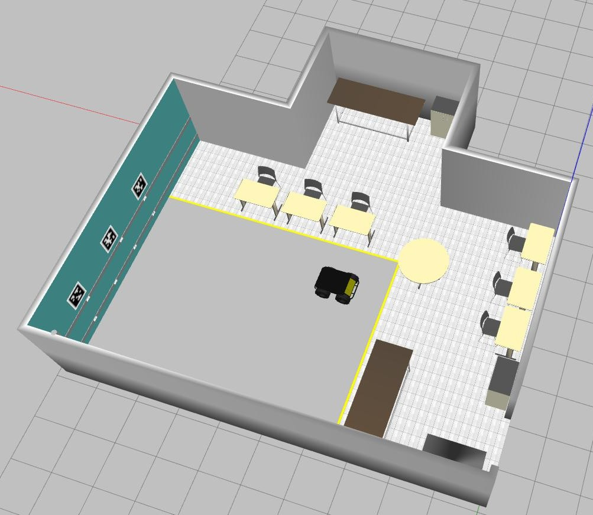

# LaR Gazebo

Repository containing the simulated environment of the Robotics Laboratory (*LaR*) at UFBA and the robot Husky from Clearpath to be used with [Gazebo].



This package has been tested under **ROS Noetic**, **Ubuntu 20.04**, and **Gazebo Classic 11.11**. The LaR Gazebo is a research repository that may change often, and any fitness for a particular purpose is disclaimed.

The package can be used in two ways:

1. **Docker-based execution**, recommended when you want a reproducible environment without manually installing ROS, Gazebo, Husky packages, and SLAM dependencies on the host machine.
2. **Native installation**, recommended when you already have a ROS Noetic workspace configured on Ubuntu 20.04.

## Table of contents

- [Docker-based execution](#docker-based-execution)
  - [Requirements](#requirements)
  - [Building the Docker image](#building-the-docker-image)
  - [Running the laboratory world](#running-the-laboratory-world)
  - [Running the Husky robot](#running-the-husky-robot)
  - [Running Hector SLAM](#running-hector-slam)
  - [Opening an interactive shell](#opening-an-interactive-shell)
  - [Sending velocity commands to the Husky](#sending-velocity-commands-to-the-husky)
  - [Running without Gazebo GUI](#running-without-gazebo-gui)
  - [Stopping containers](#stopping-containers)
  - [Docker troubleshooting](#docker-troubleshooting)
- [Native installation](#native-installation)
  - [Installation](#installation)
  - [Building](#building)
  - [Usage](#usage)
    - [Empty world](#empty-world)
    - [Husky robot](#husky-robot)
    - [Husky accessories](#husky-accessories)
    - [Hector SLAM](#hector-slam)
    - [Disable shadows](#disable-shadows)
    - [Editing the lar.world](#editing-the-larworld)
- [AprilTags](#apriltags)
- [Contributing](#contributing)
- [License](#license)

## Docker-based execution

The Docker-based workflow uses the files provided in this repository:

```bash
Dockerfile.noetic
docker-compose.yml
docker/entrypoint.sh
scripts/build.sh
scripts/shell.sh
scripts/run_world.sh
scripts/run_husky.sh
scripts/run_headless_world.sh
```

This workflow keeps the host machine cleaner and concentrates the ROS/Gazebo dependencies inside the container.

### Requirements

Install **Docker Engine** and the **Docker Compose plugin** on the host machine before using the scripts.

Official installation instructions:

- Docker Engine on Ubuntu: <https://docs.docker.com/engine/install/ubuntu/>
- Docker Compose plugin on Linux: <https://docs.docker.com/compose/install/linux/>
- General Docker installation page for other operating systems: <https://docs.docker.com/get-docker/>

After installing Docker, on Ubuntu it is recommended to allow your user to run Docker without `sudo`:

```bash
sudo usermod -aG docker $USER
newgrp docker
```

Then verify Docker:

```bash
docker --version
docker compose version
```

For graphical Gazebo execution, the container needs access to the X11 display. The provided scripts already call `xhost +local:docker`, but if necessary you can run it manually:

```bash
xhost +local:docker
```

### Building the Docker image

From the repository root, run:

```bash
./scripts/build.sh
```

If the scripts are not executable yet, run:

```bash
chmod +x scripts/*.sh
./scripts/build.sh
```

The image includes ROS Noetic, Gazebo ROS packages, Husky simulation packages, Hector SLAM packages, RViz, and common development tools.

### Running the laboratory world

To launch the empty LaR laboratory world in Gazebo:

```bash
./scripts/run_world.sh
```

This is equivalent to running the following ROS command inside the container:

```bash
roslaunch lar_gazebo lar_world.launch
```

### Running the Husky robot

To spawn the Husky robot inside the laboratory:

```bash
./scripts/run_husky.sh
```

This is equivalent to running:

```bash
roslaunch lar_gazebo lar_husky.launch
```

### Running Hector SLAM

To start the Husky simulation with Hector SLAM enabled:

```bash
./scripts/run_husky.sh hector_slam:=true
```

The Docker entrypoint sources `husky_accessories.sh` automatically when the file is available, so the default Husky accessories configured in this repository are loaded when the container starts.

### Opening an interactive shell

To open a terminal inside the Docker environment:

```bash
./scripts/shell.sh
```

Inside the container, the ROS workspace should already be sourced by the entrypoint. You can test the environment with:

```bash
rospack find lar_gazebo
rostopic list
```

If you need to source the workspace manually:

```bash
source /opt/ros/noetic/setup.bash
source /ws/devel/setup.bash
```

For better interactive use, including Bash completion, the shell should be opened as an interactive shell. If autocomplete is not available, check that `scripts/shell.sh` starts Bash with:

```bash
docker compose run --rm lar_gazebo bash -i
```

### Sending velocity commands to the Husky

After launching the Husky simulation, open another terminal and enter the container shell:

```bash
./scripts/shell.sh
```

Check the available velocity command topics:

```bash
rostopic list | grep cmd_vel
```

For the Husky simulation, the velocity topic is commonly:

```bash
/husky_velocity_controller/cmd_vel
```

You can send a simple velocity command with:

```bash
rostopic pub -r 10 /husky_velocity_controller/cmd_vel geometry_msgs/Twist "
linear:
  x: 0.3
  y: 0.0
  z: 0.0
angular:
  x: 0.0
  y: 0.0
  z: 0.2
"
```

To use keyboard teleoperation, install or keep the package `ros-noetic-teleop-twist-keyboard` in the Docker image and run:

```bash
rosrun teleop_twist_keyboard teleop_twist_keyboard.py cmd_vel:=/husky_velocity_controller/cmd_vel
```

The ROS package name is:

```bash
teleop_twist_keyboard
```

### Running without Gazebo GUI

For headless execution, for example on a server or for automated tests, run:

```bash
./scripts/run_headless_world.sh
```

This starts the LaR world without opening the Gazebo graphical interface.

### Stopping containers

If a container is still running, stop it with:

```bash
docker compose down
```

You can also list running containers with:

```bash
docker ps
```

### Docker troubleshooting

#### Gazebo does not open

Check whether the host allows Docker containers to access the display:

```bash
xhost +local:docker
```

Also check whether the `DISPLAY` variable is defined:

```bash
echo $DISPLAY
```

#### ROS commands work in one terminal but not in another

If you use `docker compose run --rm`, each command starts a new container. This is acceptable for simple runs, but for multi-terminal workflows you must make sure that all terminals are connected to the same ROS network and that `ROS_MASTER_URI` is reachable.

With `network_mode: host`, ROS topics published from the container should be visible from other containers using the same host network. If needed, inspect the environment inside the shell:

```bash
echo $ROS_MASTER_URI
echo $ROS_IP
rostopic list
```

#### Bash autocomplete does not work

Make sure the Docker image includes `bash-completion` and that the interactive shell is started with:

```bash
bash -i
```

If necessary, source Bash completion manually inside the container:

```bash
source /etc/bash_completion
source /opt/ros/noetic/setup.bash
source /ws/devel/setup.bash
```

#### `teleop_twist_keyboard` is not found

Make sure the Dockerfile installs:

```bash
ros-noetic-teleop-twist-keyboard
```

Then rebuild the image:

```bash
./scripts/build.sh
```

Test the package:

```bash
rospack find teleop_twist_keyboard
```

#### Avoid cloning with `/tree/noetic`

Use the branch option when cloning:

```bash
git clone -b noetic https://github.com/lar-deeufba/lar_gazebo.git
```

Do not use:

```bash
git clone https://github.com/lar-deeufba/lar_gazebo/tree/noetic
```

The `/tree/noetic` address is a GitHub web page path, not the Git repository URL.

## Native installation

The native workflow assumes ROS Noetic, Ubuntu 20.04, and Gazebo Classic 11 are installed directly on the host machine.

### Installation

If you do not have a [catkin workspace] configured yet, configure it first. Follow the tutorial [Creating a workspace for catkin](http://wiki.ros.org/catkin/Tutorials/create_a_workspace).

> **Attention:** The commands below assume that the workspace is named `catkin_ws` and is located in the home folder. Change the commands accordingly if you use another directory or workspace name.

After configuring the workspace, clone this repository into the source folder:

```bash
cd ~/catkin_ws/src
git clone -b noetic https://github.com/lar-deeufba/lar_gazebo.git
```

Then install the package dependencies from the root of your workspace:

```bash
cd ~/catkin_ws
rosdep init 2>/dev/null || true
rosdep update
rosdep install --from-paths src/lar_gazebo --ignore-src -r -y --rosdistro noetic
```

### Building

There are two common command-line tools to build packages in ROS 1: `catkin_make` and [catkin tools]. For beginners, `catkin tools` is usually more user-friendly.

To install `catkin tools`, follow [its tutorial](https://catkin-tools.readthedocs.io/en/latest/installing.html#installing-on-ubuntu-with-apt-get). Once installed, run:

```bash
cd ~/catkin_ws
catkin build
```

After building the package, source the workspace:

```bash
source ~/catkin_ws/devel/setup.bash
```

To source the workspace automatically in new terminals:

```bash
echo "source ~/catkin_ws/devel/setup.bash" >> ~/.bashrc
```

### Usage

There are three launch files in this repository:

1. a launch file to spawn an empty world, corresponding to the empty laboratory;
2. a launch file to spawn the Husky robot inside the laboratory, optionally with `hector_slam`;
3. a launch file to run the [hector_slam] package alone.

#### Empty world

Launch the empty LaR laboratory:

```bash
roslaunch lar_gazebo lar_world.launch
```

#### Husky robot

Spawn the Husky robot inside the laboratory:

```bash
roslaunch lar_gazebo lar_husky.launch
```

You can also launch [hector_slam] together with the Husky robot. First enable the laser scanner assembled on the robot:

```bash
cd ~/catkin_ws/src/lar_gazebo
source husky_accessories.sh
```

Then run:

```bash
roslaunch lar_gazebo lar_husky.launch hector_slam:=true
```

#### Husky accessories

The robotics community often uses the Husky robot as a platform for academic research and adapts it for specific tasks. Clearpath provides a flexible way to add devices and sensors to the robot through environment variables described in the [online documentation](http://www.clearpathrobotics.com/assets/guides/kinetic/husky/CustomizeHuskyConfig.html#environment-variables).

This package includes the [husky_accessories.sh](husky_accessories.sh) file to simplify that configuration. Uncomment or edit the desired configuration lines, then source the file again:

```bash
cd ~/catkin_ws/src/lar_gazebo
source husky_accessories.sh
```

The lines uncommented by default enable the 2D Stick LMS1XX laser scanner and the Realsense RGB-D sensor. The package also includes the [P3D](https://classic.gazebosim.org/tutorials?tut=ros_gzplugins#P3D(3DPositionInterfaceforGroundTruth)) plugin to publish the ground-truth pose of the robot in Gazebo on the topic:

```bash
gazebo_ground_truth/odom
```

#### Hector SLAM

The `hector_slam` package is not intended to run alone in the standard simulation workflow. However, if you want to analyze laser scanner data from a bag file, you can launch the Hector SLAM process with:

```bash
roslaunch lar_gazebo hector_slam.launch
```

#### Disable shadows

If you open Gazebo using the provided launch files, it opens automatically with shadows disabled.

Otherwise, disable shadows directly in the Gazebo GUI:

1. With Gazebo open, go to the left panel and locate *Scene* in the world tab.
2. Click on *Scene*.
3. Search for *shadows*.
4. Uncheck the box next to *shadows*.

> **Note:** If needed, see the [Gazebo GUI tutorial](http://gazebosim.org/tutorials?cat=guided_b&tut=guided_b2).

#### Editing the [lar.world](worlds/lar.world)

When the simulation is launched through ROS, the integration between Gazebo and ROS points to the correct path where the models used in the `.world` file are stored.

However, when opening the world directly with Gazebo, without ROS:

```bash
cd ~/catkin_ws/src/lar_gazebo
gazebo worlds/lar.world
```

Gazebo must be informed where to find the simulation models:

```bash
export GAZEBO_MODEL_PATH=$(rospack find lar_gazebo)'/models'
```

> **Note:** The `lar_gazebo` package must be installed and sourced for `rospack find lar_gazebo` to work properly.

To make this permanent, add it to your `~/.bashrc`:

```bash
echo 'export GAZEBO_MODEL_PATH=$(rospack find lar_gazebo)/models' >> ~/.bashrc
```

## AprilTags

The [AprilTags images](april_tags) were retrieved from the [apriltag-imgs] repository. Then, the [gazebo_models] package generates the Gazebo models.

The original images have size 9 x 9 pixels, while [gazebo_models] expects images with 170 x 170 pixels. Therefore, it is necessary to resize the images using the command recommended in [apriltag-imgs]:

```bash
convert <small_marker>.png -scale 170 <big_marker>.png
```

## Contributing

Pull requests are welcome. For significant changes, please open an issue to discuss what you would like to change.

Please make sure to update tests as appropriate.

## License

[BSD](https://opensource.org/licenses/BSD-2-Clause)

[apriltag-imgs]: https://github.com/AprilRobotics/apriltag-imgs/tree/master/tag36h11
[gazebo_models]: https://github.com/mikaelarguedas/gazebo_models
[Gazebo]: http://gazebosim.org/
[Husky]: http://wiki.ros.org/Robots/Husky
[catkin workspace]: http://wiki.ros.org/catkin/workspaces
[hector_slam]: http://wiki.ros.org/hector_slam
[catkin tools]: https://catkin-tools.readthedocs.io/en/latest/
